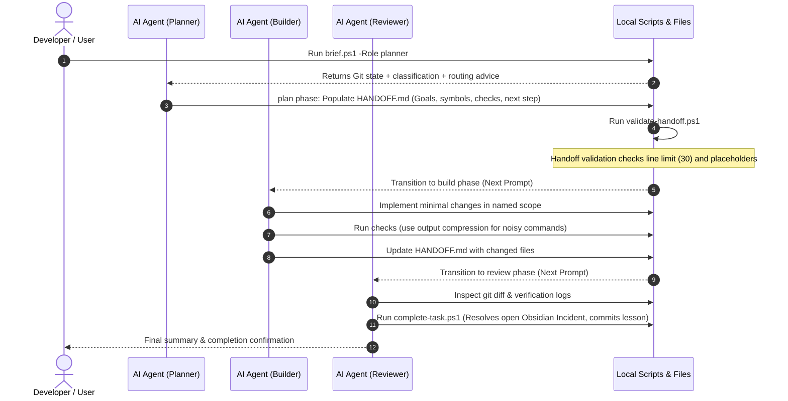

# 🌟 Universal Token-Efficient AI Agent Workflow (26/08/2026) by kisuke

A **universal, agent-agnostic** workflow for AI-assisted coding. Works seamlessly with any AI agent —
Gemini, Antigravity, Claude, GPT/Codex, Cursor, Copilot, or custom LLM assistants.

> ⚡ **Recommended Token-Saving Skills & Tools**:
> In order for your AI agent to perform even better and save maximum tokens, we strongly recommend installing or enabling:
> - **`ponytail` skill**: Ultra-lean, zero-overengineering coding mode.
> - **`caveman` skill**: Direct, blunt output mode — cuts conversational fluff.
> - **`rtk` (Rust Token Killer)** / Output filters: Compresses verbose CLI output (`git diff`, `test`, `build`).

---

## 🤖 Works with Any Agent

All AI agents look for rules at the root level. `AGENTS.md` at the project root is the **single source of truth** containing **everything** in one place:

| Agent | Entry File | Status |
|---|---|---|
| All Agents (Gemini, Antigravity, Claude, GPT/Codex, Cursor, Copilot, etc.) | `AGENTS.md` | ✅ Single canonical rulebook |

No extra files needed. All agents share the exact same deterministic rules, local scripts, and task handoff format.


---

## 📖 Table of Contents
1. [Workflow Architecture](#-workflow-architecture)
2. [Workflow Lanes & Execution Flow](#-workflow-lanes--execution-flow)
3. [The Zero-Grep Navigation Rule](#-the-zero-grep-navigation-rule)
4. [Output Compression (RTK & equivalents)](#-output-compression)
5. [Task Handoff & Knowledge Base (Obsidian)](#-task-handoff--knowledge-base-obsidian)
6. [Integrating with an Existing Project](#-integrating-with-an-existing-project)
7. [🤖 AI Bootstrapper Prompt (Fill the Gaps)](#-ai-bootstrapper-prompt-fill-the-gaps)

---

## 🏗 Workflow Architecture

Unlike naive agent frameworks that load entire directories or spam file searches (costing thousands
of tokens per turn), this workflow shifts codebase mapping to **deterministic local scripts**.


---


## 🚦 Workflow Lanes & Execution Flow

To balance safety, precision, and speed, the workflow routes requests through three distinct lanes defined in [AGENTS.md](AGENTS.md):

### 1. Answer Lane
* **Criteria**: Questions, architectural explanations, or research tasks.
* **Execution**: Read-only lookup. Respond directly. No workflow files or edits.

### 2. Small Lane
* **Criteria**: Simple, low-risk changes modifying at most 2 product files at a known edit site. No database migrations, API contract changes, or data-loss risks.
* **Execution**:
  1. Read [AGENTS.md](AGENTS.md) and [HANDOFF.md](.ai/HANDOFF.md).
  2. Run `brain-recall.ps1` with query keywords to search past lessons.
  3. Modify the files directly.
  4. Run one focused verification check.
  5. Replace [HANDOFF.md](.ai/HANDOFF.md) and call [complete-task.ps1](ai-workspace/scripts/complete-task.ps1).


### 3. Full Lane
Used for multi-step features, complex bug fixes, and higher-risk modifications.



---

## 🔍 The Zero-Grep Navigation Rule

> [!IMPORTANT]
> **Zero-Grep Rule**: Before running any wide-scope `grep` or `ripgrep` (`rg`) command, you MUST run [traverse.ps1](ai-workspace/scripts/traverse.ps1) with a specific lookup parameter.

This rule keeps token usage minimal by querying pre-computed index files and manifests instead of flooding context with source code search matches.

| Target Lookup | Traversal Syntax | Data Source |
| :--- | :--- | :--- |
| **Exact Symbol** | `powershell -File ai-workspace/scripts/traverse.ps1 -Symbol <Name>` | `symbol_index.md` |
| **API Route / Endpoint** | `powershell -File ai-workspace/scripts/traverse.ps1 -Endpoint <Route>` | `endpoint_index.md` |
| **Error Trace / Stack** | `powershell -File ai-workspace/scripts/traverse.ps1 -Err "<Trace>"` | `hot-cache.jsonl` / `incident-cache.jsonl` |
| **Logical Module** | `powershell -File ai-workspace/scripts/traverse.ps1 -Module "<Keyword>"` | `domain-manifest.yaml` |
| **Past Lessons Learned** | `powershell -File ai-workspace/scripts/traverse.ps1 -Brain "<Keywords>"` | `brain-index.md` |
| **Dependents/Callers** | `powershell -File ai-workspace/scripts/traverse.ps1 -Caller <Symbol>` | `symbol_index.md` (Callers column) |

*If and only if* the traversal returns `TRAVERSE_MISS`, the agent is permitted to fall back to standard `rg` commands.

---

## ⚡ Output Compression

Reduce shell-output tokens returned to the model. Use your agent's native method:

> [!TIP]
> Compress selectively. Keep short, targeted commands direct — filter overhead outweighs savings for small outputs.

| Agent | Method | Example |
|---|---|---|
| Gemini / Antigravity | `rtk <cmd>` | `rtk go test ./...` |
| Claude Code (CLI) | `--compact` | or `\| head -n 80` |
| GPT / Codex | PowerShell pipe | `\| Select-Object -First 50` |
| Cursor / Copilot | diff view | Use built-in diff instead of raw `git diff` |
| Any | `git diff --stat` | Summary only, not full patch |

Full reference: [`RTK.md`](RTK.md) — covers RTK commands + per-agent equivalents.

---


## 📝 Task Handoff & Knowledge Base (Obsidian)

The single source of truth for the active task state is [.ai/HANDOFF.md](.ai/HANDOFF.md).

```markdown
# Handoff
- **Goal / state**: [Brief task summary and status]
- **Exact paths+symbols**: [File paths with line ranges]
- **Ordered edits**: [Numbered list, max 8 bullets]
- **Reuse/deletions**: [Patterns to copy or obsolete code to delete]
- **Invariants**: [Functional rules that must not break]
- **Changed files**: [List of modified files]
- **Checks**: [Exact test/lint commands run to verify]
- **Blockers**: None
- **Exact next step**: [One-sentence instruction for the next phase]
```

> [!WARNING]
> **Line Limit**: `HANDOFF.md` must stay under **30 lines** to conserve the context window. Running [validate-handoff.ps1](ai-workspace/scripts/validate-handoff.ps1) enforces this limit before the building phase begins.

### Durable Knowledge
* **`research.md`**: Disposable, session-specific facts.
* **`lessons-learned.md`**: Permanent repository of bug root-causes and verified fixes.
* **Obsidian Vault (`ai-workspace/Obsidian/`)**: Architectural design records, dictionaries, and incident tracking (`Incidents/Open` and `Incidents/Resolved`).

---

## ⚙ Integrating with an Existing Project

### Step 1: Copy folders
Copy the following into your project root:
```
.ai/
ai-workspace/
.agents/
AGENTS.md
```

### Step 2: Run setup (one command)
```powershell
# Rename generate-diff-brief.ps1 → setup.ps1 first, then run:
powershell -NoProfile -ExecutionPolicy Bypass -File ai-workspace/scripts/setup.ps1 -ProjectName "YourProjectName"
```

This single command:
- Fills all `{{PROJECT_NAME}}` and `{{USERNAME}}` placeholders
- Sets `.ai/PROJECT` to your project root path
- Generates the initial symbol and endpoint indexes
- Verifies the workflow structure

### Step 3: Fill in conventions + domain (or let AI do it)
Fill [conventions.md](ai-workspace/agents/conventions.md) and [domain-manifest.yaml](ai-workspace/agents/domain-manifest.yaml) manually, **or** paste the AI Bootstrapper Prompt below into your AI agent to do it automatically.

---


## 🤖 AI Bootstrapper Prompt (Fill the Gaps)

To automate **Step 4** and **Step 5**, you can paste the following prompt into your AI assistant. The agent will inspect your codebase structure, write the configurations, and generate initial indexes.

````markdown
You are a Senior Project Bootstrapper Agent. Configure the project-local AI agent workspace
to match this codebase's stack, commands, structure, and domain boundaries.

1. **Inspect Codebase**: Scan root + config files (package.json, go.mod, Cargo.toml,
   requirements.txt, compose.yml) to discover language(s), framework, DB, runtime version.

2. **Commands**: Find the exact shell commands for dev server, build, tests, lint, and clean.

3. **Directory Map**: Write a concise directory tree of source, tests, and config locations.

4. **Populate conventions.md** (`ai-workspace/agents/conventions.md`):
   - Fill `Repo:`, `Stack:`, `Primary runtime/version:`, `Required databases/services:`
   - Fill `## Commands` and `## Directory Structure Map` with what you discovered.

5. **Populate domain-manifest.yaml** (`ai-workspace/agents/domain-manifest.yaml`):
   - Identify main modules (e.g. auth, billing, notifications, storage).
   - Add `backend:` and `frontend:` entries with `keywords`, `handlers`, `services`, `tests`, `hot_symbols`.

6. **Generate Indexes**:
   - Run: `powershell -NoProfile -ExecutionPolicy Bypass -File ai-workspace/scripts/generate-index.ps1`

7. **Verify**: Run `powershell -NoProfile -ExecutionPolicy Bypass -File ai-workspace/scripts/check-workflow.ps1`
   and report any failures plus a concise summary of what was configured.
````

---

> [!NOTE]
> **Cross-platform**: Scripts are PowerShell (`.ps1`) for Windows. On macOS/Linux, write Bash
> equivalents of `brief.ps1`, `traverse.ps1`, `validate-handoff.ps1`, and `complete-task.ps1`
> that emit the same key:value output format. The workflow logic is identical.
> <!-- ponytail: PS-only ceiling; upgrade: add bash/ equivalents when cross-platform adoption justifies it -->
