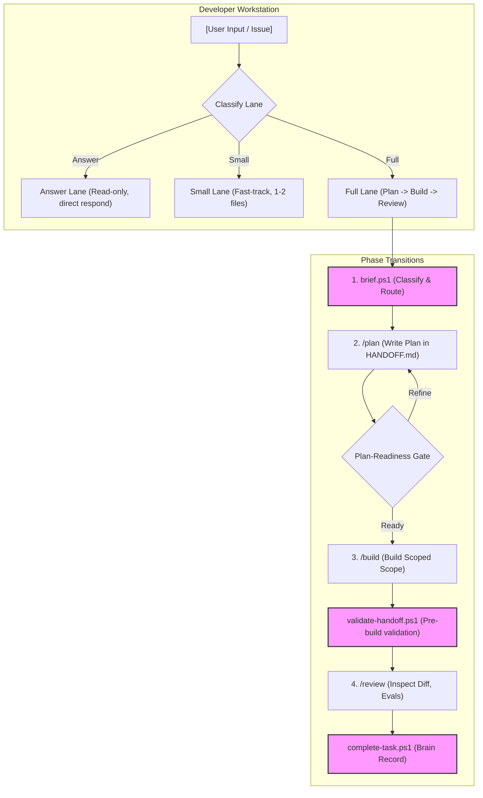
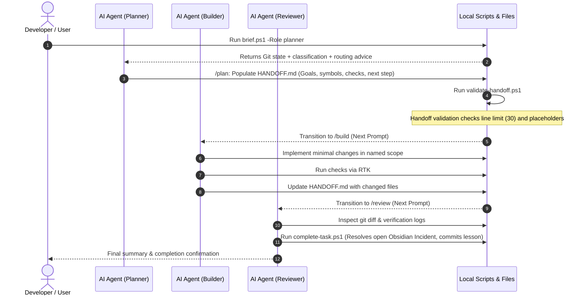

# 🌟 Token-Efficient AI Agent Workflow Guide

This guide details the **Token-Efficient, Local-Script-Driven AI Agent Workflow**, designed to optimize LLM context usage, enforce planning-before-execution separation, and leverage zero-grep codebase navigation. It is built specifically for **Google Antigravity** and **Codex** agents.

---

## 📖 Table of Contents
1. [Workflow Architecture](#-workflow-architecture)
2. [Workflow Lanes & Execution Flow](#-workflow-lanes--execution-flow)
3. [The Zero-Grep Navigation Rule](#-the-zero-grep-navigation-rule)
4. [Rust Token Killer (RTK) CLI Proxy](#-rust-token-killer-rtk-cli-proxy)
5. [Task Handoff & Knowledge Base (Obsidian)](#-task-handoff--knowledge-base-obsidian)
6. [Integrating with an Existing Project](#-integrating-with-an-existing-project)
7. [🤖 AI Bootstrapper Prompt (Fill the Gaps)](#-ai-bootstrapper-prompt-fill-the-gaps)

---

## 🏗 Workflow Architecture

Unlike naive agent frameworks that load entire directories or spam file searches (costing thousands of tokens per turn), this workflow shifts codebase mapping and discovery to **deterministic local scripts**. 



---

## 🚦 Workflow Lanes & Execution Flow

To balance safety, precision, and speed, the workflow routes requests through three distinct lanes defined in [AGENTS.md](file:///D:/empty%20template/.ai/AGENTS.md):

### 1. Answer Lane
* **Criteria**: Questions, architectural explanations, or research tasks.
* **Execution**: Read-only lookup. Respond directly. No workflow files or edits.

### 2. Small Lane
* **Criteria**: Simple, low-risk changes modifying at most 2 product files at a known edit site. No database migrations, API contract changes, or data-loss risks.
* **Execution**:
  1. Read [AGENTS.md](file:///D:/empty%20template/.ai/AGENTS.md) and [HANDOFF.md](file:///D:/empty%20template/.ai/HANDOFF.md).
  2. Run `brain-recall.ps1` with query keywords to search past lessons.
  3. Modify the files directly.
  4. Run one focused verification check.
  5. Replace [HANDOFF.md](file:///D:/empty%20template/.ai/HANDOFF.md) and call [complete-task.ps1](file:///D:/empty%20template/ai-workspace/scripts/complete-task.ps1).

### 3. Full Lane
Used for multi-step features, complex bug fixes, and higher-risk modifications.



---

## 🔍 The Zero-Grep Navigation Rule

> [!IMPORTANT]
> **Zero-Grep Rule**: Before running any wide-scope `grep` or `ripgrep` (`rg`) command, you MUST run [traverse.ps1](file:///D:/empty%20template/ai-workspace/scripts/traverse.ps1) with a specific lookup parameter.

This rule keeps token usage minimal by querying pre-computed index files and manifests instead of flooding context with source code search matches.

| Target Lookup | Traversal Syntax | Data Source |
| :--- | :--- | :--- |
| **Exact Symbol** | `powershell -File ai-workspace/scripts/traverse.ps1 -Symbol <Name>` | `symbol_index.md` |
| **API Route / Endpoint** | `powershell -File ai-workspace/scripts/traverse.ps1 -Endpoint <Route>` | `endpoint_index.md` |
| **Error Trace / Stack** | `powershell -File ai-workspace/scripts/traverse.ps1 -Err "<Trace>"` | `hot-cache.jsonl` / `incident-cache.jsonl` |
| **Logical Module** | `powershell -File ai-workspace/scripts/traverse.ps1 -Module "<Keyword>"` | `domain-manifest.yaml` |
| **Past Lessons Learned** | `powershell -File ai-workspace/scripts/traverse.ps1 -Brain "<Keywords>"` | `brain-index.md` |
| **Dependents/Callers** | `powershell -File ai-workspace/scripts/traverse.ps1 -Caller <Symbol>` | `symbol_index.md` (Callers column) |

*If and only if* the traversal returns `TRAVERSE_MISS`, the agent is permitted to fall back to standard `rg` commands.

---

## ⚡ Rust Token Killer (RTK) CLI Proxy

The workflow utilizes the **Rust Token Killer (RTK)** wrapper to run shell commands with highly verbose outputs (like test runs, package builds, linters, or `docker ps`). RTK filters and compresses the console output to save model tokens.

> [!TIP]
> Use `rtk` selectively! Keep short, single-line commands direct. Do not prefix every command as the proxy overhead is unnecessary for minor logs.

```bash
# Optimized CLI calls
rtk cargo test
rtk go test ./...
rtk git status
rtk rg "pattern" src/

# Diagnostics & Meta Commands
rtk gain              # Check token savings metrics
rtk gain --history    # View full run execution history with savings
rtk proxy <command>   # Bypass filtering and show raw output (emergency override)
```

---

## 📝 Task Handoff & Knowledge Base (Obsidian)

The single source of truth for the active task state is [.ai/HANDOFF.md](file:///D:/empty%20template/.ai/HANDOFF.md). 

```markdown
# Handoff
- **Goal / state**: [Brief task summary and status]
- **Exact paths+symbols**: [File paths with line ranges]
- **Ordered edits**: [Numbered list, max 8 bullets]
- **Reuse/deletions**: [Patterns to copy or obsolete code to delete]
- **Invariants**: [Functional rules that must not break]
- **Changed files**: [List of modified files]
- **Checks**: [Exact test/lint commands run to verify]
- **Blockers**: None
- **Exact next step**: [One-sentence instruction for the next phase]
```

> [!WARNING]
> **Line Limit**: `HANDOFF.md` must stay under **30 lines** to conserve the context window. Running [validate-handoff.ps1](file:///D:/empty%20template/ai-workspace/scripts/validate-handoff.ps1) enforces this limit before the building phase begins.

### Durable Knowledge
* **`research.md`**: Disposable, session-specific facts.
* **`lessons-learned.md`**: Permanent repository of bug root-causes and verified fixes.
* **Obsidian Vault (`ai-workspace/Obsidian/`)**: Architectural design records, dictionaries, and incident tracking (`Incidents/Open` and `Incidents/Resolved`).

---

## ⚙ Integrating with an Existing Project

Follow these steps to configure your existing project with this workflow:

### Step 1: Copy Workspace Templates
Copy the following folders from the template to the root of your existing project:
* `.ai/`
* `ai-workspace/`
* `.agents/` (if present)

### Step 2: Configure Workspace Paths
Open `.ai/PROJECT` and replace the path with your project's absolute path:
```text
D:/your-existing-project
```

### Step 3: Update Placeholders
In [.ai/AGENTS.md](file:///D:/empty%20template/.ai/AGENTS.md) and [.ai/HANDOFF.md](file:///D:/empty%20template/.ai/HANDOFF.md), replace all occurrences of `{{PROJECT_NAME}}` with your actual project name.

### Step 4: Populate Conventions
Edit [conventions.md](file:///D:/empty%20template/ai-workspace/agents/conventions.md) to define your stack, package setup, test execution, linting guidelines, and file structure rules.

### Step 5: Map Logical Domains
Update [domain-manifest.yaml](file:///D:/empty%20template/ai-workspace/agents/domain-manifest.yaml) to associate domain/module keywords with specific files, components, and directories. This file is parsed by `brief.ps1` to route query keywords automatically.

### Step 6: Generate Code Indexes
Execute the indexing script to build your symbol and API route tables:
```powershell
powershell -NoProfile -ExecutionPolicy Bypass -File ai-workspace/scripts/generate-index.ps1
```
This writes the commit-stamped indexing files:
* `ai-workspace/agents/references/symbol_index.md`
* `ai-workspace/agents/references/endpoint_index.md`

---

## 🤖 AI Bootstrapper Prompt (Fill the Gaps)

To automate **Step 4** and **Step 5**, you can paste the following prompt into your AI assistant. The agent will inspect your codebase structure, write the configurations, and generate initial indexes.

````markdown
You are a Senior Project Bootstrapper Agent. Your goal is to configure our project-local AI agent workspace to match this codebase's development stack, commands, structure, and domain boundaries.

Please perform the following operations:

1. **Inspect Codebase**:
   - Scan the root directory and project configuration files (e.g. package.json, go.mod, Cargo.toml, requirements.txt, gemfile, compose.yml) to discover the programming language(s), framework stack, database services, and runtime versions.

2. **Establish Setup & Run Commands**:
   - Determine the correct development shell commands used to:
     - Install dependencies
     - Run the development server
     - Run unit and integration tests
     - Run linters and formatting commands
     - Build the production bundle/executable

3. **Map Directory Layout**:
   - Create a concise directory map showcasing the core layout of source files, tests, and configuration files.

4. **Populate Conventions**:
   - Open `ai-workspace/agents/conventions.md`.
   - Update `Repo:`, `Stack:`, `Primary runtime/version:`, and `Required databases/services:`.
   - Populate the `## Commands` and `## Directory Structure Map` sections with the concrete commands and layout discovered.

5. **Delineate Logical Modules (Manifest)**:
   - Identify the main application modules (e.g. auth, billing, notifications, rides, database adapters).
   - Open `ai-workspace/agents/domain-manifest.yaml`.
   - Add entries under the `backend:` and `frontend:` sections. For each module, outline matching search keywords, documentation files, source code components, tests, and primary symbols.

6. **Generate Indexes**:
   - Run the script `powershell -NoProfile -ExecutionPolicy Bypass -File ai-workspace/scripts/generate-index.ps1` to compile the initial symbol and endpoint reference indices.

7. **Verify & Report**:
   - Run `powershell -NoProfile -ExecutionPolicy Bypass -File ai-workspace/scripts/check-workflow.ps1` to verify the workspace integrity.
   - Present a concise summary of the generated configurations, stack attributes, and any manual configuration overrides I need to examine.
````

---

### Ponytail Simplified Setup
> [!NOTE]
> Upgrade path: This workflow uses PowerShell scripts (`.ps1`) for local orchestration. If your development machines do not use Windows/PowerShell, you can quickly write Bash or Python equivalents of `brief.ps1`, `traverse.ps1`, `validate-handoff.ps1`, and `complete-task.ps1` that output the exact same formatted outputs.
